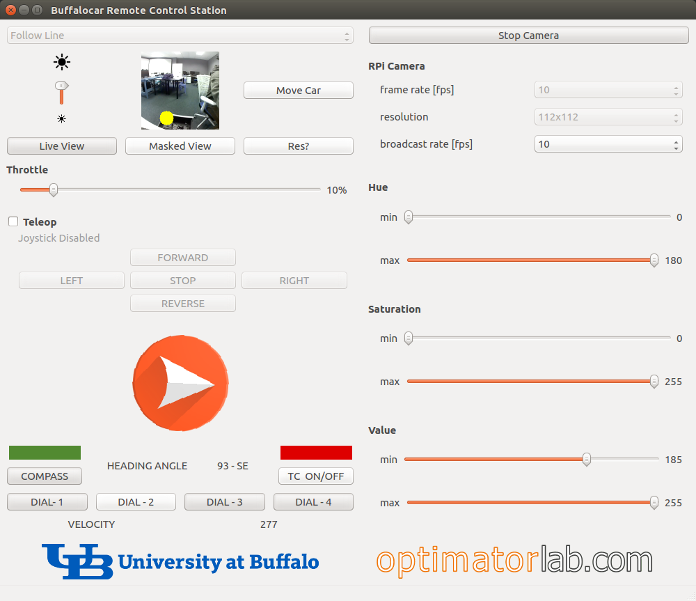

# Vision Based Line Follower (Buffalo Car)

Project Name:

- Controller / Host - `buffalocar`
- (CAR) Ras_Pi - `buffalocar_pi`			

Team Member(s):

- Akarsh Pallassana Sivaprasad (50289834)

## Project Description

The project has three main components;

- Setting up the Buffalo Car (University at Buffalo's version of Donkey Car) to work with a Laptop or a Desktop running Linux on a virtual machine or a standalone DOS. This also involves configuring the host laptop or desktop to communicate with the Raspberry Pi on board the Buffalo Car through          Wi-Fi (Secure Shell Protocol)
- Integrating an i2C compass module (Adafruit LSM303-DLHC) to the existing bus and read the Magnetometer and Accelerometer values and compute that into an Azimuth or Heading angle and publish it back to the controller's GUI (Graphical User Interface)
- Modifying the Python script on the host to subscribe to the topic that publishes the Azimuth and create an interactive layout on the GUI which displays the Azimuth angle along with an animated pointer. 

### Contributions

- Mapped the existing program/nodal flow between the Host and the Buffalo Car.

- Interfaced the compass module as a cascade from the i2C servo hat(No need for a splitter cable).

  - A splitter cable is a cable that is used to connect 1 male/female header to 2 male/female headers, how ever we did not require this because the servo hat board already had a spare i2c bus extension pins.

  

  The bus lines can be flipped on either side. There wont be any problem as long as straight connections are made.

  

  - Refer the compass wiring table to know about the hook up points.

- GUI modified to fit the compass readout cluster.


- Created a new TOPIC to transfer messages regarding LSM303.
- Added a Compass ON/OFF toggle switch and a N-E-W-S direction monitor to the GUI.


- Added a Tilt Compensation ON/OFF switch and a Velocity readout (Experimental Feature in DEV).
- The Buffalo Car now has a functioning compass with an interactive Azimuth readout.
  - AZIMUTH - An azimuth is an angular measurement in a spherical coordinate system. The vector from an observer to a point of interest is projected perpendicularly onto a reference plane; the angle between the projected vector and a reference vector on the reference plane is called the 
    azimuth.

---

## Installation Instructions

List of Prerequisite Hardware / Software:
- A Laptop or a Desktop running Ubuntu 14.0.4* with ROS Indigo Igloo (Controller / Host)

- Assembled Buffalo Car running Linux and ROS on its on-board Raspberry Pi.                                   (Contact Dr. Murray to get access to the custom Ras_Pi OS image)

  

- Preconfigured Wi-Fi Router and Necessary Ethernet Cables.

  (Contact Dr. Murray to get the Secure Shell Password for the Buffalo Car)

  

  ​												* Ubuntu can also be run from a Virtual Machine

## Setting Up Raspberry Pi

Connect the RPi to a Monitor, Keyboard, Mouse and Internet for the SETUP. (Only required for fresh install)
1. Expand the Filesystem, enable the RPi Camera, and enable I2C Bus:

   ```
   sudo raspi-config
   ```

   - Select "expand filesystem".  This will maximize use of your SD card.
   - Select camera.
   - Select advanced > enable I2C.
   - Reboot

   *You only need to do this once.*

2. Install the Updated Buffalo Car Code on your RPi:

   - Clone this git repository:

   ```
    cd ~/Downloads
    git clone -b master https://github.com/optimatorlab/buffalocar.git
   ```

   - Run the installation script:

   ```
    cd ~/Downloads/buffalocar
    chmod +x install_pi.sh
    ./install_pi.sh
    chmod -x install_pi.sh
   ```

   ​									*use Step 2 at any time if the GitHub source has been updated*

## Setting Up Laptop or Desktop

1. Install PyQT4 (GUI Repository for the Interface):

   ```
    sudo apt-get install python-qt4
   ```

2. Installing the Buffalo Car code:

   - Clone this git repository:

   ```
    cd ~/Downloads
    git clone -b master https://github.com/optimatorlab/buffalocar.git
   ```

   - Run the installation script:

   ```
    cd ~/Downloads/buffalocar
    chmod +x install_laptop.sh
    ./install_laptop.sh
    chmod -x install_laptop.sh
   ```

   ​									*use Step 2 at any time if the GitHub source has been updated*

## Wiring LSM303 to Raspberry Pi

1. After receiving the sensor, unpack and solder the male header pins with the component surface of the PCB as the top as shown in the image below.


2. Add a double sided Velcro strip to the flat side of the PCB to make it easier to mount it to the vehicle.

3. Choose a 2 pair or 4 Female - Female jumper cables for connecting the LSM module to the i2C bus.

   

4. Connect the module to the cascade i2C bus on the Servo Hat by following the table below and mount the module to the top above the Camera.

<TABLE>
<TR>
	<TH bgcolor=#f2f1e6><center>LSM303</center></TH>
    <TH bgcolor=#f2f1e6><center>SERVO HAT</center></TH>
	<TH bgcolor=#f2f1e6><center>JUMPER CABLE COLOR*</center></TH>
</TR>
<TR>
	<TD bgcolor=#e5f1e8><center>Vin</center></TD>
    <TD bgcolor=#e5f1e8><center>Vcc</center></TD>
    <TD bgcolor="#ea0b4a"><center><b>RED</b></center></TD>
</TR>
<TR>
	<TD bgcolor=#e5f1e8><center>GND</center></TD>
    <TD bgcolor=#e5f1e8><center>GND</center></TD>
    <TD bgcolor="#b58c5e"><center><b>DARK BROWN</b></center></TD>
</TR>
<TR>
	<TD bgcolor=#e5f1e8><center>SCL</center></TD>
    <TD bgcolor=#e5f1e8><center>SCL</center></TD>
    <TD bgcolor="#f2e835"><center><b>YELLOW</b></center></TD>
</TR>
<TR>
	<TD bgcolor=#e5f1e8><center>SDA</center></TD>
    <TD bgcolor=#e5f1e8><center>SDA</center></TD>
    <TD bgcolor="#ffb547"><center><b>ORANGE</b></center></TD>
</TR> 
</TABLE>


​										    ** Cable colors can be customized but should be documented*


## Installing LSM303 Library on Raspberry Pi

1. Clone this git repository and Install it:

   ```
   cd ~
   git clone https://github.com/adafruit/Adafruit_Python_LSM303.git
   cd Adafruit_Python_LSM303
   sudo python setup.py install
   ```

2. Make sure the i2C lines are hooked up, You will get an error in the i2C read() function if the the connections are improper or disconnected.

## Running the Code

The Raspberry Pi and the Laptop/Desktop should be connected to the same network (same router).
You need to know the IP address of the RPi before continuing.

1. In TERMINAL 1 from your **Laptop / Desktop**:

   - Use the following command to find the IP Address of the Raspberry Pi

     ```
     ping <name_of_pi>.local
     ```

   - Connect to the RPi

     ```
      ssh pi@IP_ADDRESS_OF_RPI
     ```

     Replace `IP_ADDRESS_OF_RPI` as appropriate (e.g., 192.168.0.1). 

   - Start the code on the RPi:

     ```
      roscd buffalocar_pi/scripts
      ./start_pi.sh
     ```

2. In TERMINAL 2 from your **Laptop / Desktop**, start the viewer to watch the video feed and manage the car:

   ```
   roscd buffalocar/scripts
   ./start_viewer.sh IP_ADDRESS_OF_RPI
   ```

   Replace `IP_ADDRESS_OF_RPI` to match what you used in Step 1/b (e.g., 192.168.0.1).

   *NOTE*: If you get an error when running this script, take a look at the Troubleshooting section below.

3. In the Buffalo Car's GUI,

   - Change the Camera Settings as desired, since these can't be changed when the camera starts.

     - Frame Rate - **10**
     - Resolution - **112 x 112** (Default)
     - Broadcast Rate - **10** (max)

   - Hit `COMPASS` in the GUI to switch on the compass (Status GREEN). This is followed by the animation of the North pointer as it points towards the magnetic North along with the Heading angle readout (with respect to the car).

   - When you're ready, click the `Start Camera` button (top right) and do not forget to remove the  Lens Cap.

   - Adjust the Hue, Saturation and Value sliders until the red/yellow dot on the camera monitor locks on to the line ahead.

     

   - The `Move Car` button will turn on the Autonomous Driving Mode(Line Follower), adjust the throttle until the value is above the stall speed or simply till the car start to move. (IDEAL - 23%)

   - The `Teleop` flag will let you manually control the car.  The car cannot be in both auto and teleop modes simultaneously.

   - Hit `TC ON / OFF` in the GUI to switch on the Tilt Compensation(Status GREEN). This uses the accelerometer on board the LSM303 to measure the roll and pitch and does simple trigonometric computation to cancel out the deviation on the compass heading value when the vehicle is tilted.

     (*the TC feature is not working as it should, more research is needed to fine tune the TC algorithm.*)

     

   - Use the DIAL 1 | 2 | 3 | 4 buttons to change the compass dial style.

   

   

4. When you're done:

   - Hit `COMPASS` in the GUI to switch off the compass (Status RED) and `TC ON / OFF` (Status RED).

   

   - Hit `Stop Camera` in the GUI.
   - Go to TERMINAL 1 and Stop roscore:

   ```
   ./stop_pi.sh
   ```

   If you don't run this shell script, you'll get an error about roscore already running the next time you repeat these steps.

5. You might want to re-set ROS_MASTER_URI to its default value:

   ```
   export ROS_MASTER_URI=http://localhost:11311
   ```

   This is the same command to issue in both terminal windows.

---

## TROUBLESHOOTING

- If you get an running the start_viewer.sh, try running "ifconfig" from the terminal to get the network adapter name and replace it on the start_viewer script.

## Measures of Success

<TABLE>
<TR>
    <TH><center>Measure of Success</center></TH>
    <TH><center>STATUS (Completion Percentage)</center></TH>
</TR>
<TR>
	<TD>Establish communication between host and the Buffalo Car.</TD>
    <TD><center>100%</center></TD>
</TR>
<TR>
	<TD>Make the bot follow a line (White Tape).</TD>
	<TD><center>100%</center></TD>
</TR>
<TR>
	<TD>Interface the compass module using ROS/Python libraries.</TD>
	<TD><center>100%</center></TD>
</TR>
<TR>
	<TD>Display the heading angle on the existing Buffalo Car GUI.</TD>
	<TD><center>100%</center></TD>
</TR>
<TR>
	<TD>Add Tilt Compensation algorithm in the compass node.</TD>
	<TD><center>100% - But no Significant Improvement</center></TD>
</TR>
<TR>
	<TD>Provide system documentation (README.md)</TD>
	<TD><center>100%</center></TD>
</TR>
</TABLE>
---

## What did you learn from this project?

- Learnt a lot about working with wireless ROS Nodes.
  - This project uses several ROS nodes in which some transfer messages through wireless networking.
  - Works with SSH (Secure Shell).
- Experimented with duplex message transmission between ROS Nodes.
- Gained immense knowledge on GUI programming (PyQT / QT GUI).
  - Created / Modified GUI layout.
  - Used Widgets, Push Buttons, Pixmaps and Matrix transformation etc.,
- Learnt on how to interface and use external electronic modules with Raspberry Pi through Python and ROS.
  - Use the ADAFRUIT Library to initialize and read the compass and accelerometer values.

---

## Future Work

Possible Future Developments:

1. Develop a more robust Compass Tilt Compensation Algorithm.
   - The Tilt Compensation algorithm is not working as it is supposed to be. More work has to be done in manually doing the tilt compensation and finding the exact algorithm the will work for the LSM303.
   - Use POLOLU's LSM303 tilt compensation guide as a start point.
2. Implement the Object Follower script to make the car follow an object / marker.
   - The idea is to alter the image masking part of the code to detect the color of an object and modify the steering and throttle controls to make the car follow the object maintaining a distance.
3. Re-arrange the GUI and add more features to it such as Live Steering angle readout.
   - As we know the live steering angle we can use the transformation script used for the compass pointer to animate a steering wheel.
4. Use the Accelerometer to estimate the linear travel velocity of the Buffalo Car.
   - The good news here is we have a working 3 axis accelerometer. We can use this to estimate the instantaneous velocity at any point in time by reading the sensor at a predetermined time interval.
5. Add GPS and Auto Pilot feature to the car.
   - As of now the car is being used indoors where GPS doesn't make any sense. We can interface an USB GPS module to car and develop an auto pilot system in the aim of using the car outdoors where it can navigate itself to the end point with CV / LIDAR based obstacle detection.

---

## References / Resources

- https://github.com/optimatorlab/buffalocar
- http://pyqt.sourceforge.net/Docs/PyQt4/qtgui.html
- https://stackoverflow.com/questions/12924550/pyqt4-qpixmap-rotating-jpg-according-to-exif
- https://learn.adafruit.com/lsm303-accelerometer-slash-compass-breakout/overview
- https://github.com/adafruit/Adafruit_Python_LSM303

*A Special Thanks to Dr. Chase Murray IE582 Instructor / Optimator Lab for this wonderful opportunity*

